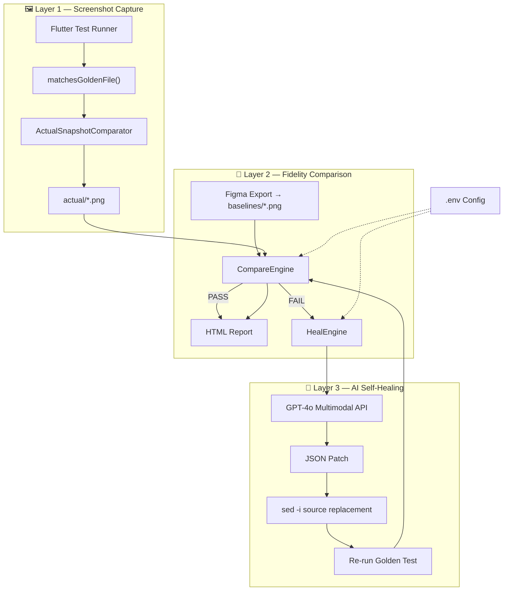
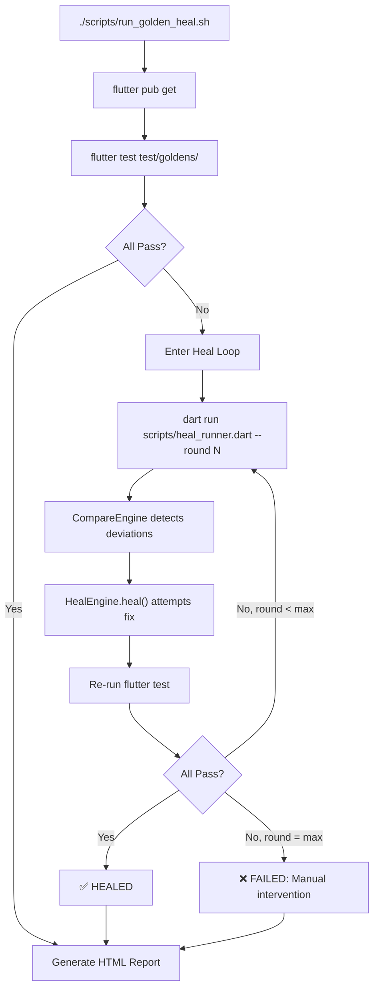
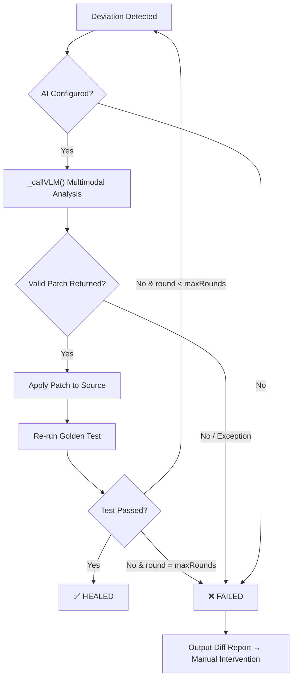

<div align="center">

# 🔬 Flutter Golden Test UI Self-Healing

### AI-Driven Visual Regression Detection & Auto-Repair Framework

Multi-dimensional comparison between Figma design baselines and Flutter render screenshots.<br/>
When UI fidelity deviations are detected, automatically invokes **GPT-4o multimodal analysis**<br/>
to generate precise source code patches — achieving autonomous self-healing in CI pipelines.

[](https://flutter.dev/)
[](https://dart.dev/)
[](https://openai.com/)
[](./LICENSE)

[简体中文](./README.md) · **English**

</div>

---

## Table of Contents

- [Highlights](#highlights)
- [Architecture Overview](#architecture-overview)
- [Core Components](#core-components)
  - [CompareEngine — Multi-Dimensional Comparison](#compareengine--multi-dimensional-comparison)
  - [HealEngine — AI Self-Healing Engine](#healengine--ai-self-healing-engine)
  - [ActualSnapshotComparator — Safe Capture Layer](#actualsnapshotcomparator--safe-capture-layer)
  - [EnvConfig — Environment Configuration](#envconfig--environment-configuration)
  - [ReportGenerator — Visual Report](#reportgenerator--visual-report)
- [Self-Healing Workflow](#self-healing-workflow)
  - [CI Heal Loop](#ci-heal-loop)
  - [HealEngine Decision Flow](#healengine-decision-flow)
- [Quick Start](#quick-start)
- [Configuration](#configuration)
- [Project Structure](#project-structure)
- [Threshold Tuning Guide](#threshold-tuning-guide)
- [Example Output](#example-output)
- [Design Decisions](#design-decisions)
- [License](#license)

---

## Highlights

| # | Feature | Description |
|---|---------|-------------|
| 1 | **Pixel Diff + SSIM** | Per-pixel RGB distance + 8x8 sliding window SSIM, dual-metric deviation quantification |
| 2 | **AI-Driven Repair** | GPT-4o receives baseline/actual/diff images + source code + metrics, generates targeted patches |
| 3 | **Zero Hard-Coded Rules** | No inflexible rule engine — different components have different specs, AI handles judgment |
| 4 | **Multi-Round Healing** | Up to 3 iterative heal rounds per component until tests pass |
| 5 | **Baseline Protection** | `baselines/` is read-only — `--update-goldens` cannot overwrite Figma exports |
| 6 | **CI-Ready** | Single script integration: capture → compare → repair → retest → report |
| 7 | **HTML Visual Report** | UI Fidelity Score + per-component status cards + SSIM/PixelDiff metrics |
| 8 | **Enterprise Proxy Support** | TLS certificate bypass + auto-complete API path for corporate network environments |

---

## Architecture Overview



> **Design Philosophy**: Two-layer decoupling — Layer 1 only handles screenshot capture
> (always writes to `actual/`, always passes). Layer 2 independently performs high-precision
> comparison and AI repair. No interference between layers.

---

## Core Components

### CompareEngine — Multi-Dimensional Comparison

Implements pixel-level + structural similarity dual-dimensional analysis using `image` 4.x API:

| Dimension | Algorithm | Description |
|-----------|-----------|-------------|
| **Pixel Diff** | Per-pixel RGB distance | Single-channel delta exceeding `colorTolerance` counts as different |
| **SSIM** | 8×8 sliding window | Luminance × Contrast × Structure weighted components |

#### Pass Condition

```dart
final pass = diffCount == 0 ||
    (diffPercent < pixelDiffThreshold && ssimValue >= ssimThreshold);
```

#### Default Thresholds

| Parameter | Default | Meaning |
|-----------|---------|---------|
| `ssimThreshold` | 0.95 | Minimum SSIM to pass |
| `pixelDiffThreshold` | 0.002 (0.2%) | Maximum allowed different pixel ratio |
| `colorTolerance` | 10 | Per-channel color tolerance (0-255), filters anti-aliasing noise |

### HealEngine — AI Self-Healing Engine

The system's core — leverages Vision-Language Models for autonomous repair.

**VLM Input (4 elements)**:

1. **Baseline image** — Figma design export (base64)
2. **Actual image** — Flutter render screenshot (base64)
3. **Diff image** — Red-marked deviation pixels (base64)
4. **Source code** + **Quantitative metrics** (SSIM, pixelDiffPercent)

**VLM Output**:

```json
{
  "original": "exact match string in source code",
  "modified": "replacement code",
  "reason": "explanation of the fix"
}
```

**Key Implementation Details**:

| Point | Implementation |
|-------|---------------|
| Encoding Safety | `request.add(utf8.encode(requestBody))` replaces `request.write()` to avoid latin1 encoding truncation |
| Enterprise Proxy | `badCertificateCallback = (cert, host, port) => true` for TLS interception |
| Path Completion | Auto-appends `/chat/completions` if endpoint doesn't include it |
| Degradation | Returns null when AI unavailable — no blind guessing |

### ActualSnapshotComparator — Safe Capture Layer

Custom `GoldenFileComparator` ensuring:

- **Always writes** to `actual/` directory
- **Never overwrites** `baselines/` — protects Figma design sources
- **Always returns pass** — real comparison happens independently in Layer 2

### EnvConfig — Environment Configuration

`.env` file parser featuring:

- KEY=VALUE format with optional quoted values
- Automatic upward directory search (up to 5 levels)
- Result caching to avoid repeated I/O
- Comment and empty line handling

### ReportGenerator — Visual Report

Outputs comprehensive HTML report:

- **UI Fidelity Score** — weighted pass rate across all components
- **Per-component status cards** — PASS / HEALED / FAILED visual indicators
- **Metric details** — SSIM values + pixel diff percentages + diff image preview

---

## Self-Healing Workflow

### CI Heal Loop



### HealEngine Decision Flow



---

## Quick Start

### Prerequisites

- Flutter SDK 3.44+
- Dart SDK 3.12+
- OpenAI-compatible API Key (for AI self-healing)

### 1. Install Dependencies

```bash
flutter pub get
```

### 2. Configure AI

```bash
# Copy configuration template
cp .env.example .env

# Fill in actual values
vim .env
```

### 3. Prepare Baselines

Place Figma-exported design screenshots in `test/goldens/baselines/`:

```
test/goldens/baselines/
├── app_button_primary_default.png
├── app_button_disabled_default.png
├── user_card_standard_default.png
└── ...
```

### 4. Run Tests

```bash
# Golden test only (screenshot capture)
flutter test test/goldens/

# Full self-healing pipeline
./scripts/run_golden_heal.sh

# Update actual screenshots
./scripts/run_golden_heal.sh --update

# Test specific component
./scripts/run_golden_heal.sh --component app_button

# Set max heal rounds
./scripts/run_golden_heal.sh --max-rounds 5
```

### 5. Verify AI Connectivity

```bash
dart run scripts/test_ai_connectivity.dart
```

---

## Configuration

### `.env` File

```env
# AI API endpoint (OpenAI-compatible)
# System auto-appends /chat/completions if not included
UI_HEAL_API_ENDPOINT=https://api.openai.com/v1

# API Key
UI_HEAL_API_KEY=sk-your-api-key-here

# Model name (recommend gpt-4o for strong multimodal capabilities)
UI_HEAL_MODEL=gpt-4o

# Request timeout (seconds)
UI_HEAL_TIMEOUT=60
```

| Variable | Required | Default | Description |
|----------|----------|---------|-------------|
| `UI_HEAL_API_ENDPOINT` | Yes | — | OpenAI-compatible API base URL |
| `UI_HEAL_API_KEY` | Yes | — | API authentication key |
| `UI_HEAL_MODEL` | No | `gpt-4o` | Model identifier |
| `UI_HEAL_TIMEOUT` | No | `60` | Request timeout in seconds |

> **Supported Providers**: OpenAI / Azure OpenAI / ByteDance internal models / Any OpenAI-compatible endpoint

---

## Project Structure

```
flutter_ui_heal_by_ai/
├── lib/
│   ├── components/                   UI components (heal targets)
│   │   ├── app_button.dart             Button component
│   │   ├── user_card.dart              User card
│   │   └── metric_badge.dart           Metric badge
│   └── ui_heal/                      Core self-healing framework
│       ├── heal_engine.dart            HealEngine — AI repair orchestrator
│       ├── compare_engine.dart         CompareEngine — Pixel Diff + SSIM
│       ├── env_config.dart             EnvConfig — .env parser
│       └── report_generator.dart       ReportGenerator — HTML report
│
├── test/
│   ├── flutter_test_config.dart      Global golden config (ActualSnapshotComparator)
│   └── goldens/
│       ├── baselines/                  Figma design screenshots (read-only baseline)
│       ├── actual/                     Flutter render captures (auto-generated)
│       ├── diff/                       Difference visualization
│       ├── app_button_golden_test.dart
│       ├── user_card_golden_test.dart
│       ├── metric_badge_golden_test.dart
│       └── heal_integration_test.dart  Integration test
│
├── scripts/
│   ├── run_golden_heal.sh            CI entry — orchestrates heal rounds
│   ├── heal_runner.dart              Dart script — file mapping + engine invocation
│   ├── generate_report.dart          Report generator
│   ├── test_ai_connectivity.dart     AI connectivity verification
│   ├── export_figma_baselines.sh     Figma baseline export (Shell)
│   └── export_figma_baselines_dart.dart  Figma baseline export (Dart)
│
├── .env.example                      AI configuration template
├── pubspec.yaml                      Dart dependency declaration
└── README.md / README.en.md          Documentation (Chinese / English)
```

### Dependency Diagram

```
┌──────────────────────────────────┐
│  scripts/                        │  CI Entry & Orchestration
│  run_golden_heal.sh              │
│  heal_runner.dart                │
└──────────┬───────────────────────┘
           │ invokes
┌──────────▼───────────────────────┐
│  lib/ui_heal/                    │  Core Engines
│  ┌─────────────┐ ┌────────────┐  │
│  │CompareEngine│ │ HealEngine │  │
│  └──────┬──────┘ └──────┬─────┘  │
│         │               │         │
│  ┌──────▼──────┐ ┌──────▼─────┐  │
│  │ image 4.x   │ │ EnvConfig  │  │
│  │(Pixel/SSIM) │ │(.env parse)│  │
│  └─────────────┘ └────────────┘  │
└──────────────────────────────────┘
           │ outputs
┌──────────▼───────────────────────┐
│  ReportGenerator → HTML Report   │
└──────────────────────────────────┘
```

---

## Threshold Tuning Guide

| Parameter | Default | Increasing | Decreasing |
|-----------|---------|------------|------------|
| `ssimThreshold` | 0.95 | Stricter: minor layout shifts trigger FAIL | More tolerant of structural changes |
| `pixelDiffThreshold` | 0.002 | More permissive: allows more different pixels | Stricter: catches subtle color deviations |
| `colorTolerance` | 10 | Ignores more rendering noise | Catches finer color differences |
| `maxRounds` | 3 | More repair attempts, longer CI time | Faster failure feedback |

### `colorTolerance` Explained

When comparing two pixels, if the difference in any single R/G/B channel exceeds this value,
the pixel is counted as "different":
- **Set to 10**: Filters anti-aliasing and cross-platform rendering noise, catches only genuine design deviations
- **Set to 0**: Any sub-pixel difference triggers, prone to false positives
- **Set to 20+**: May miss subtle but meaningful color changes

---

## Example Output

```
=== Heal Runner (round 1) ===
  Healing: app_button_primary_default (FAIL: pixels=1689 (0.352%), SSIM=0.9952)
    Applied: [AI] The button's corner radius is too rounded (30px) compared
             to the Figma design (8px). This fix adjusts the border radius.
  Re-running golden tests...
  All tests passed!

========================================
  ✅ HEALED in round 1
========================================
```

---

## Design Decisions

### Why no rule engine fallback?

Different pages and components have entirely different specs for border radius, font size,
spacing, etc. Hard-coded rules cannot cover real-world scenarios and produce more false fixes
than correct ones. When AI is unavailable, the system **reports failure transparently** for
manual intervention — this is safer than blind guessing.

### Why `request.add(utf8.encode(...))` instead of `request.write()`?

Dart's `HttpClientRequest.write()` defaults to latin1 encoding. When the request body contains
large amounts of base64 characters (image encoding), it throws "Invalid characters" because
characters exceed the 0-255 range. `request.add(utf8.encode(...))` writes UTF-8 byte stream
directly, completely avoiding the encoding issue.

### Why does ActualSnapshotComparator always return pass?

The Golden Test framework's native `matchesGoldenFile` throws an exception and aborts the test
when images don't match, preventing subsequent components from being captured. We need to
complete full screenshot collection first, then perform unified comparison and repair.

### Can I use a local/self-hosted model?

Yes. Any OpenAI-compatible API endpoint works. Set `UI_HEAL_API_ENDPOINT` to your local server URL.

---

## Test Coverage

| Component | Scenarios | Baselines |
|-----------|-----------|-----------|
| AppButton | primary / disabled / secondary | 3 |
| UserCard | standard / long_email | 2 |
| MetricBadge | pass / fail / warning | 3 |

---

## Dependencies

| Package | Version | Purpose |
|---------|---------|---------|
| flutter | 3.44 | Widget rendering & test framework |
| image | ^4.3.0 | PNG decode, pixel ops, SSIM calculation |
| flutter_test | SDK built-in | Golden Test framework |

---

## License

MIT
</div>
