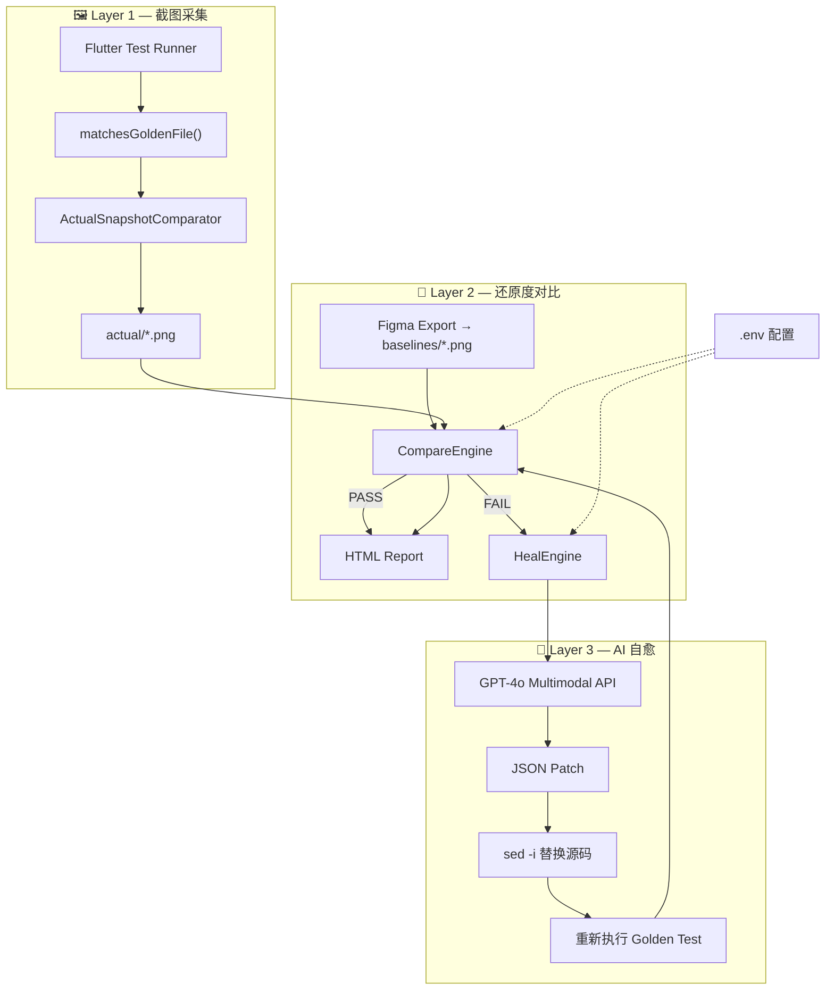
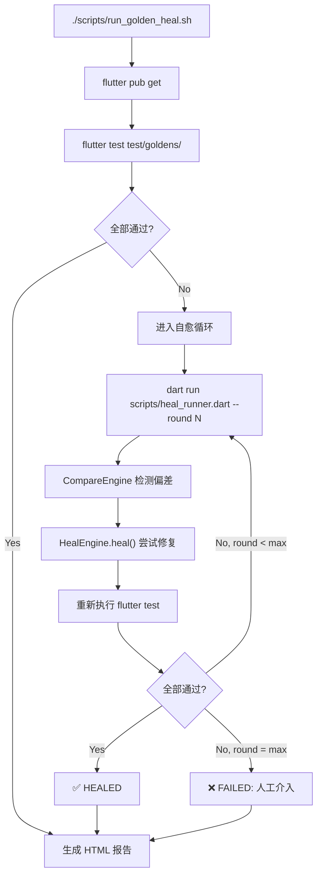
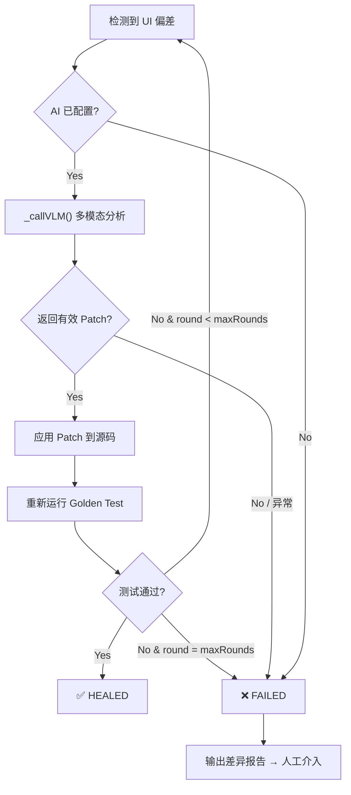

<div align="center">

# 🔬 Flutter Golden Test UI Self-Healing

### AI 驱动的视觉回归检测与自动修复框架

基于 Figma 设计稿基准图与 Flutter 渲染截图的多维对比，<br/>
当检测到 UI 还原度偏差时，自动调用 **GPT-4o 多模态分析**生成精准代码补丁，实现 Golden Test 失败的自主修复。

[](https://flutter.dev/)
[](https://dart.dev/)
[](https://openai.com/)
[](./LICENSE)

**简体中文** · [English](./README.en.md)

</div>

---

## 目录

- [核心特性](#核心特性)
- [整体架构](#整体架构)
- [核心组件](#核心组件)
  - [CompareEngine — 多维对比引擎](#compareengine--多维对比引擎)
  - [HealEngine — AI 自愈引擎](#healengine--ai-自愈引擎)
  - [ActualSnapshotComparator — 安全截图层](#actualsnapshotcomparator--安全截图层)
  - [EnvConfig — 环境配置](#envconfig--环境配置)
  - [ReportGenerator — 可视化报告](#reportgenerator--可视化报告)
- [自愈工作流](#自愈工作流)
  - [CI 自愈循环](#ci-自愈循环)
  - [HealEngine 决策流程](#healengine-决策流程)
- [快速开始](#快速开始)
- [配置项](#配置项)
- [项目结构](#项目结构)
- [阈值调优指南](#阈值调优指南)
- [示例输出](#示例输出)
- [设计决策](#设计决策)
- [License](#license)

---

## 核心特性

| # | 特性 | 说明 |
|---|------|------|
| 1 | **Pixel Diff + SSIM 双重检测** | 逐像素 RGB 距离 + 8x8 滑动窗口 SSIM，双维度量化偏差 |
| 2 | **AI 驱动修复** | GPT-4o 同时接收 baseline/actual/diff 三图 + 源码 + 指标，生成精准补丁 |
| 3 | **零硬编码规则** | 不依赖僵化规则引擎——不同组件规格各异，由 AI 判断修复策略 |
| 4 | **多轮迭代修复** | 每组件最多 3 轮自愈循环，直至测试通过或上限耗尽 |
| 5 | **基准保护机制** | `baselines/` 只读——`--update-goldens` 无法覆写 Figma 设计稿 |
| 6 | **CI 即插即用** | 单脚本集成，自动截图 → 对比 → 修复 → 重测 → 报告 |
| 7 | **HTML 可视化报告** | UI 保真度分数 + 逐组件状态卡 + SSIM/PixelDiff 指标 |
| 8 | **企业代理兼容** | TLS 证书旁路 + 自动补全 API 路径，适配公司内网环境 |

---

## 整体架构



> **设计理念**：两层解耦——Layer 1 只负责截图采集（始终写入 `actual/`，始终通过），
> Layer 2 独立执行高精度对比与 AI 修复，互不干扰。

---

## 核心组件

### CompareEngine — 多维对比引擎

基于 `image` 4.x API 实现像素级 + 结构化双维度分析：

| 维度 | 算法 | 说明 |
|------|------|------|
| **Pixel Diff** | 逐像素 RGB 距离 | 单通道差值超 `colorTolerance` 计为差异像素 |
| **SSIM** | 8×8 滑动窗口 | 亮度 × 对比度 × 结构 三分量加权 |

#### 通过条件

```dart
final pass = diffCount == 0 ||
    (diffPercent < pixelDiffThreshold && ssimValue >= ssimThreshold);
```

#### 默认阈值

| 参数 | 默认值 | 含义 |
|------|--------|------|
| `ssimThreshold` | 0.95 | 最低 SSIM 通过线 |
| `pixelDiffThreshold` | 0.002 (0.2%) | 最大允许差异像素占比 |
| `colorTolerance` | 10 | 单通道颜色容差（0-255），过滤抗锯齿噪声 |

### HealEngine — AI 自愈引擎

系统核心——利用 Vision-Language Model 实现自主修复。

**VLM 输入（四要素）**：

1. **Baseline 图片** — Figma 设计稿导出（base64）
2. **Actual 图片** — Flutter 渲染截图（base64）
3. **Diff 图片** — 红色标记差异像素（base64）
4. **源代码** + **量化指标**（SSIM、pixelDiffPercent）

**VLM 输出**：

```json
{
  "original": "源码中的精确匹配字符串",
  "modified": "替换后的代码",
  "reason": "修复原因说明"
}
```

**关键实现细节**：

| 要点 | 实现 |
|------|------|
| 编码安全 | `request.add(utf8.encode(requestBody))` 替代 `request.write()`，避免 latin1 编码截断 |
| 企业代理 | `badCertificateCallback = (cert, host, port) => true` 兼容 TLS 拦截 |
| 路径补全 | 自动追加 `/chat/completions`（如 endpoint 未包含） |
| 降级策略 | AI 不可用时直接返回 null，不做盲猜修复 |

### ActualSnapshotComparator — 安全截图层

自定义 `GoldenFileComparator`，确保：

- **始终写入** `actual/` 目录
- **永不覆写** `baselines/` — 保护 Figma 设计源文件
- **始终返回通过** — 真正的对比在 Layer 2 独立执行

### EnvConfig — 环境配置

`.env` 文件解析器：

- KEY=VALUE 格式，支持引号包裹值
- 自动向上搜索最多 5 层父目录
- 解析结果缓存，避免重复 I/O
- 自动忽略注释行和空行

### ReportGenerator — 可视化报告

输出综合 HTML 报告：

- **UI 保真度分数** — 所有组件加权通过率
- **逐组件状态卡** — PASS / HEALED / FAILED 可视化标识
- **指标详情** — SSIM 值 + 像素差异百分比 + diff 图预览

---

## 自愈工作流

### CI 自愈循环



### HealEngine 决策流程



---

## 快速开始

### 前置要求

- Flutter SDK 3.44+
- Dart SDK 3.12+
- OpenAI 兼容 API Key（用于 AI 自愈）

### 1. 安装依赖

```bash
flutter pub get
```

### 2. 配置 AI

```bash
# 复制配置模板
cp .env.example .env

# 编辑填入实际值
vim .env
```

### 3. 准备 Baselines

将 Figma 导出的设计截图放入 `test/goldens/baselines/`：

```
test/goldens/baselines/
├── app_button_primary_default.png
├── app_button_disabled_default.png
├── user_card_standard_default.png
└── ...
```

### 4. 运行测试

```bash
# 仅运行 Golden Test（截图采集）
flutter test test/goldens/

# 完整自愈流程
./scripts/run_golden_heal.sh

# 更新 actual 截图
./scripts/run_golden_heal.sh --update

# 测试单个组件
./scripts/run_golden_heal.sh --component app_button

# 设置最大修复轮次
./scripts/run_golden_heal.sh --max-rounds 5
```

### 5. 验证 AI 连通性

```bash
dart run scripts/test_ai_connectivity.dart
```

---

## 配置项

### `.env` 文件

```env
# AI API 端点 (OpenAI 兼容接口)
# 系统自动追加 /chat/completions（如未包含）
UI_HEAL_API_ENDPOINT=https://api.openai.com/v1

# API Key
UI_HEAL_API_KEY=sk-your-api-key-here

# 模型名称 (推荐 gpt-4o，多模态能力强)
UI_HEAL_MODEL=gpt-4o

# 请求超时 (秒)
UI_HEAL_TIMEOUT=60
```

| 变量 | 必填 | 默认值 | 说明 |
|------|------|--------|------|
| `UI_HEAL_API_ENDPOINT` | 是 | — | OpenAI 兼容 API 基础 URL |
| `UI_HEAL_API_KEY` | 是 | — | API 认证密钥 |
| `UI_HEAL_MODEL` | 否 | `gpt-4o` | 模型标识符 |
| `UI_HEAL_TIMEOUT` | 否 | `60` | 请求超时（秒） |

> **支持的 API 提供商**：OpenAI / Azure OpenAI / 字节内部模型 / 任何 OpenAI 兼容端点

---

## 项目结构

```
flutter_ui_heal_by_ai/
├── lib/
│   ├── components/                   UI 组件（自愈目标）
│   │   ├── app_button.dart             按钮组件
│   │   ├── user_card.dart              用户卡片
│   │   └── metric_badge.dart           指标徽章
│   └── ui_heal/                      核心自愈框架
│       ├── heal_engine.dart            HealEngine — AI 修复编排器
│       ├── compare_engine.dart         CompareEngine — Pixel Diff + SSIM
│       ├── env_config.dart             EnvConfig — .env 解析器
│       └── report_generator.dart       ReportGenerator — HTML 报告
│
├── test/
│   ├── flutter_test_config.dart      全局 Golden 配置（ActualSnapshotComparator）
│   └── goldens/
│       ├── baselines/                  Figma 设计截图（只读基准）
│       ├── actual/                     Flutter 渲染截图（自动生成）
│       ├── diff/                       差异可视化图
│       ├── app_button_golden_test.dart
│       ├── user_card_golden_test.dart
│       ├── metric_badge_golden_test.dart
│       └── heal_integration_test.dart  集成测试
│
├── scripts/
│   ├── run_golden_heal.sh            CI 入口 — 编排自愈轮次
│   ├── heal_runner.dart              Dart 脚本 — 文件映射 + 引擎调用
│   ├── generate_report.dart          报告生成器
│   ├── test_ai_connectivity.dart     AI 连通性验证
│   ├── export_figma_baselines.sh     Figma 基准导出（Shell）
│   └── export_figma_baselines_dart.dart  Figma 基准导出（Dart）
│
├── .env.example                      AI 配置模板
├── pubspec.yaml                      Dart 依赖声明
└── README.md                         本文档
```

### 依赖关系

```
┌──────────────────────────────────┐
│  scripts/                        │  CI 入口 & 编排
│  run_golden_heal.sh              │
│  heal_runner.dart                │
└──────────┬───────────────────────┘
           │ 调用
┌──────────▼───────────────────────┐
│  lib/ui_heal/                    │  核心引擎
│  ┌─────────────┐ ┌────────────┐  │
│  │ CompareEngine│ │ HealEngine │  │
│  └──────┬──────┘ └──────┬─────┘  │
│         │               │         │
│  ┌──────▼──────┐ ┌──────▼─────┐  │
│  │ image 4.x   │ │ EnvConfig  │  │
│  │ (Pixel/SSIM)│ │ (.env 解析)│  │
│  └─────────────┘ └────────────┘  │
└──────────────────────────────────┘
           │ 输出
┌──────────▼───────────────────────┐
│  ReportGenerator → HTML Report   │
└──────────────────────────────────┘
```

---

## 阈值调优指南

| 参数 | 默认值 | 调高影响 | 调低影响 |
|------|--------|----------|----------|
| `ssimThreshold` | 0.95 | 更严格：微小布局偏移也报 FAIL | 更宽松：容忍轻微结构变化 |
| `pixelDiffThreshold` | 0.002 | 更宽松：允许更多差异像素 | 更严格：捕获细微颜色偏差 |
| `colorTolerance` | 10 | 忽略更多渲染噪声 | 捕获更精细颜色差异 |
| `maxRounds` | 3 | 更多修复机会，CI 耗时增加 | 更快失败反馈 |

### `colorTolerance` 详解

比较两个像素时，R/G/B 任一通道差值超过此值则计为"不同"：
- **设为 10**：过滤抗锯齿和跨平台渲染噪声，仅捕获真正的设计属性偏差
- **设为 0**：任何亚像素差异都触发，容易误报
- **设为 20+**：可能漏掉细微但有意义的颜色变化

---

## 示例输出

```
=== Heal Runner (round 1) ===
  Healing: app_button_primary_default (FAIL: pixels=1689 (0.352%), SSIM=0.9952)
    Applied: [AI] The button's corner radius is too rounded (30px) compared
             to the Figma design (8px). This fix adjusts the border radius.
  Re-running golden tests...
  All tests passed!

========================================
  ✅ HEALED in round 1
========================================
```

---

## 设计决策

### 为什么没有规则引擎兜底？

不同页面和组件的圆角、字号、间距等属性各不相同，硬编码规则无法覆盖真实场景，
产生的错误修复多于正确修复。当 AI 不可用时，系统**透明地报告失败**由人工介入——
这比盲目猜测更安全。

### 为什么用 `request.add(utf8.encode(...))` 而非 `request.write()`？

Dart `HttpClientRequest.write()` 默认使用 latin1 编码，当 request body 包含
大量 base64 字符（图片编码）时会因字符超出 0-255 范围而抛出 "Invalid characters" 异常。
`request.add(utf8.encode(...))` 直接写入 UTF-8 字节流，彻底规避编码问题。

### 为什么 ActualSnapshotComparator 始终返回通过？

Golden Test 框架原生的 `matchesGoldenFile` 会在图片不匹配时直接抛异常中断测试，
导致后续组件无法截图。我们需要先完成全量截图采集，再统一对比修复。

### 可以使用本地/私有化部署的模型吗？

可以。任何 OpenAI 兼容的 API 端点均可使用。设置 `UI_HEAL_API_ENDPOINT` 为本地服务器 URL 即可。

---

## 测试覆盖

| 组件 | 场景 | Baselines 数量 |
|------|------|----------------|
| AppButton | primary / disabled / secondary | 3 |
| UserCard | standard / long_email | 2 |
| MetricBadge | pass / fail / warning | 3 |

---

## 依赖

| Package | Version | 用途 |
|---------|---------|------|
| flutter | 3.44 | Widget 渲染 & 测试框架 |
| image | ^4.3.0 | PNG 解码、像素操作、SSIM 计算 |
| flutter_test | SDK 内置 | Golden Test 框架 |

---

## License

MIT
</div>
