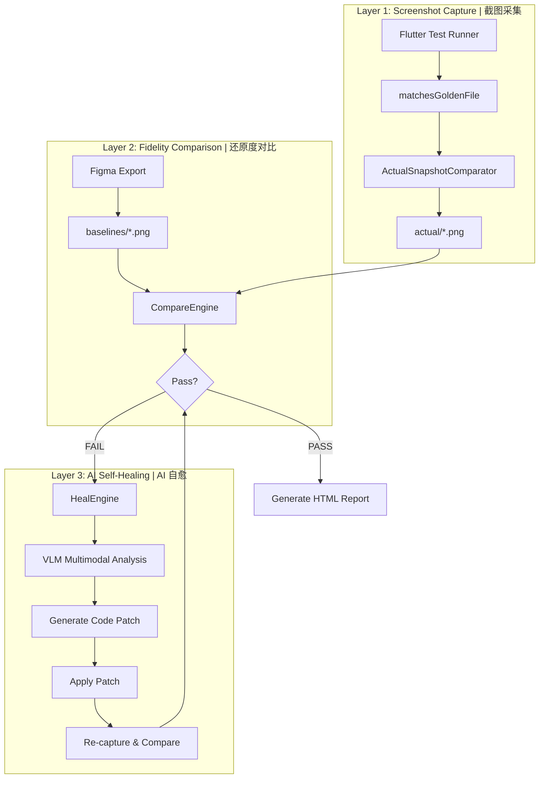
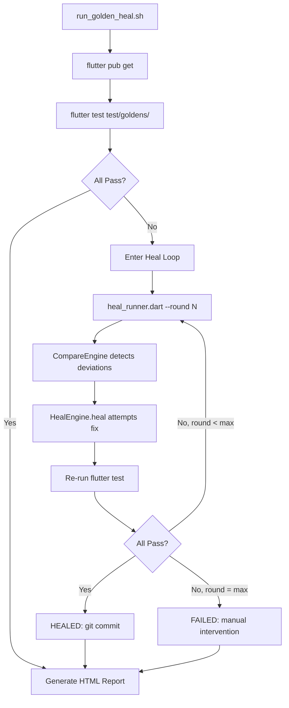
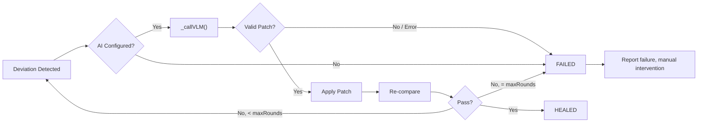

# Flutter Golden Test UI Self-Healing

基于 Figma 设计稿基准图与 Flutter 代码渲染截图的多维对比，当检测到 UI 还原度偏差时，自动调用 VLM（GPT-4o）分析差异并生成精准代码补丁，实现 Golden Test 失败的自动修复。

A multi-dimensional comparison between Figma design baselines and Flutter code render screenshots. When UI fidelity deviations are detected, the system automatically invokes a VLM (GPT-4o) to analyze differences and generate precise code patches, enabling self-healing of Golden Test failures.

## Architecture | 架构



## Features | 特性

- **Two-Layer Comparison | 两层对比**：Layer 1 captures screenshots to `actual/`; Layer 2 compares against Figma baselines via Pixel Diff + SSIM
- **AI-Driven Self-Healing | AI 驱动自愈**：GPT-4o receives baseline + actual + diff images + source code, returns precise code patches
- **Baseline Protection | 基准保护**：`baselines/` directory is read-only; `--update-goldens` cannot overwrite Figma exports
- **HTML Report | 可视化报告**：Generates fidelity score report with per-component status
- **CI Integration | CI 集成**：Shell script with auto-heal loop (max 3 rounds) and git auto-commit

## Project Structure | 目录结构

```
flutter_demo/
├── lib/
│   ├── components/              # UI components (heal targets)
│   │   ├── app_button.dart
│   │   ├── user_card.dart
│   │   └── metric_badge.dart
│   └── ui_heal/                 # Self-healing engine core
│       ├── compare_engine.dart  # Pixel Diff + SSIM comparison
│       ├── heal_engine.dart     # AI self-healing engine
│       ├── env_config.dart      # .env file parser
│       └── report_generator.dart
├── test/
│   ├── flutter_test_config.dart # Global golden config
│   └── goldens/
│       ├── baselines/           # Figma design exports (read-only)
│       ├── actual/              # Code render snapshots (auto-updated)
│       ├── diff/                # Difference visualization
│       └── *_golden_test.dart
├── scripts/
│   ├── run_golden_heal.sh       # CI entry point
│   ├── heal_runner.dart         # Heal orchestrator
│   └── generate_report.dart     # Report generator
├── .env.example                 # AI config template
└── pubspec.yaml
```

## Quick Start | 快速开始

### Prerequisites | 前置条件

- Flutter SDK 3.44+
- Dart SDK 3.12+
- OpenAI-compatible API key (for AI self-healing)

### Setup | 配置

```bash
# 1. Install dependencies | 安装依赖
flutter pub get

# 2. Configure AI (copy template and fill in values) | 配置 AI
cp .env.example .env
# Edit .env with your API endpoint and key
```

### `.env` Configuration | 配置项

```bash
UI_HEAL_API_ENDPOINT=https://api.openai.com/v1
UI_HEAL_API_KEY=sk-your-key-here
UI_HEAL_MODEL=gpt-4o
UI_HEAL_TIMEOUT=60
```

### Run Tests | 运行测试

```bash
# Run all golden tests | 运行全部 Golden 测试
flutter test test/goldens/

# Run with auto-healing | 运行自愈流程
./scripts/run_golden_heal.sh

# Update actual screenshots only | 仅更新截图
./scripts/run_golden_heal.sh --update

# Test specific component | 测试单个组件
./scripts/run_golden_heal.sh --component app_button

# Set max heal rounds | 设置最大自愈轮次
./scripts/run_golden_heal.sh --max-rounds 5
```

## CI Self-Healing Flow | CI 自愈流程



## HealEngine Flow | 自愈引擎流程



## CompareEngine | 对比引擎

Two-dimensional fidelity comparison | 两维度还原度对比：

| Dimension | Method | Description |
|-----------|--------|-------------|
| Pixel Diff | Per-pixel RGB distance | Counts pixels exceeding `colorTolerance` (default: 10) |
| SSIM | 8×8 sliding window | Structural Similarity Index (luminance, contrast, structure) |

### Thresholds | 阈值

| Parameter | Default | Description |
|-----------|---------|-------------|
| `ssimThreshold` | 0.95 | Minimum SSIM to pass |
| `pixelDiffThreshold` | 0.002 (0.2%) | Maximum allowed pixel diff ratio |
| `colorTolerance` | 10 | Per-channel color tolerance (0-255), filters anti-aliasing noise |

### Pass Condition | 通过条件

```dart
final pass = diffCount == 0 ||
    (diffPercent < pixelDiffThreshold && ssimValue >= ssimThreshold);
```

## VLM Integration | VLM 集成

The AI receives a multimodal request containing:

1. **Baseline image** — Figma design export (ground truth)
2. **Actual image** — Flutter code render
3. **Diff image** — Red-marked difference pixels
4. **Source code** + **Metrics** (SSIM, pixel diff %)

Returns a JSON patch:

```json
{
  "original": "<exact string to find in source>",
  "modified": "<replacement code>",
  "reason": "<explanation>"
}
```

> **Note**: When AI is not configured, the system does not attempt rule-based guessing — different components have different design specs, making hardcoded rules unreliable. It reports FAILED directly for manual intervention.
>
> **注意**：AI 未配置时系统不做规则猜测修复——不同组件的设计规范各异，硬编码规则不可靠。直接报告失败由人工介入。

## Test Coverage | 测试覆盖

| Component | Scenarios | Baselines |
|-----------|-----------|-----------|
| AppButton | primary / disabled / secondary | 3 |
| UserCard | standard / long_email | 2 |
| MetricBadge | pass / fail / warning | 3 |

## Dependencies | 依赖

| Package | Version | Purpose |
|---------|---------|---------|
| flutter | 3.44 | Widget rendering & test framework |
| image | ^4.3.0 | PNG decode, pixel ops, SSIM calculation |
| flutter_test | SDK built-in | Golden Test framework |

## Example Output | 示例输出

```
=== Heal Runner (round 1) ===
  Healing: app_button_primary_default (FAIL: pixels=1689 (0.352%), SSIM=0.9952)
    Applied: [AI] The button's corner radius is too rounded (30px) compared
             to the Figma design (8px). This fix adjusts the border radius.
  Re-running golden tests...
  All tests passed!

========================================
  HEALED in round 1
========================================
```

## License

MIT
